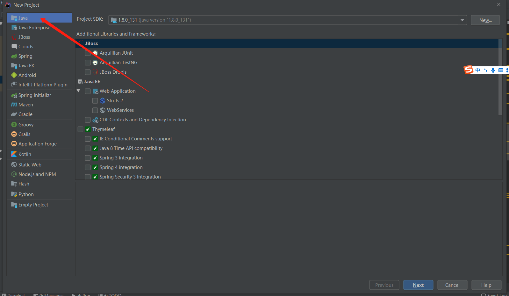
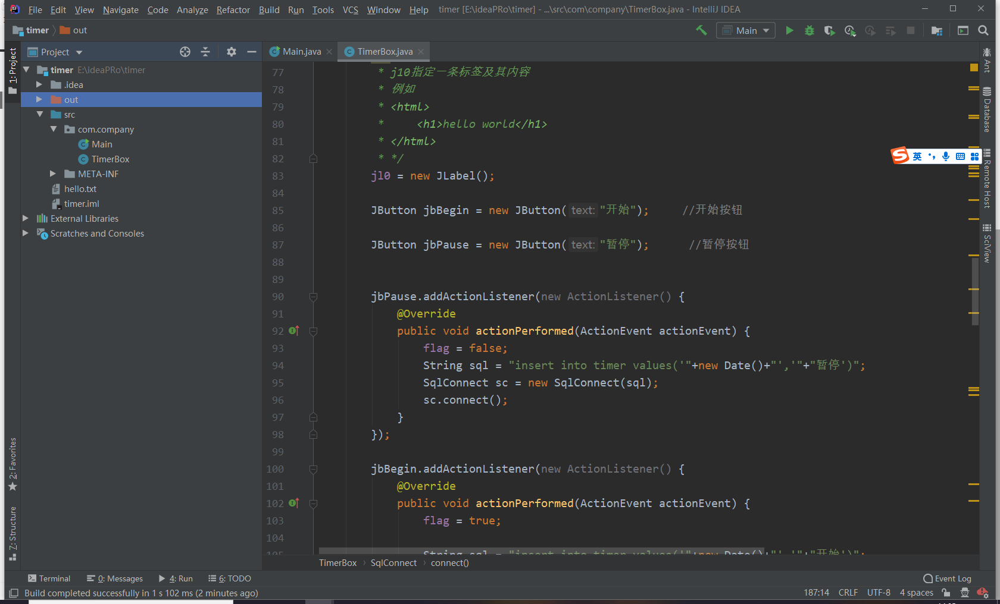
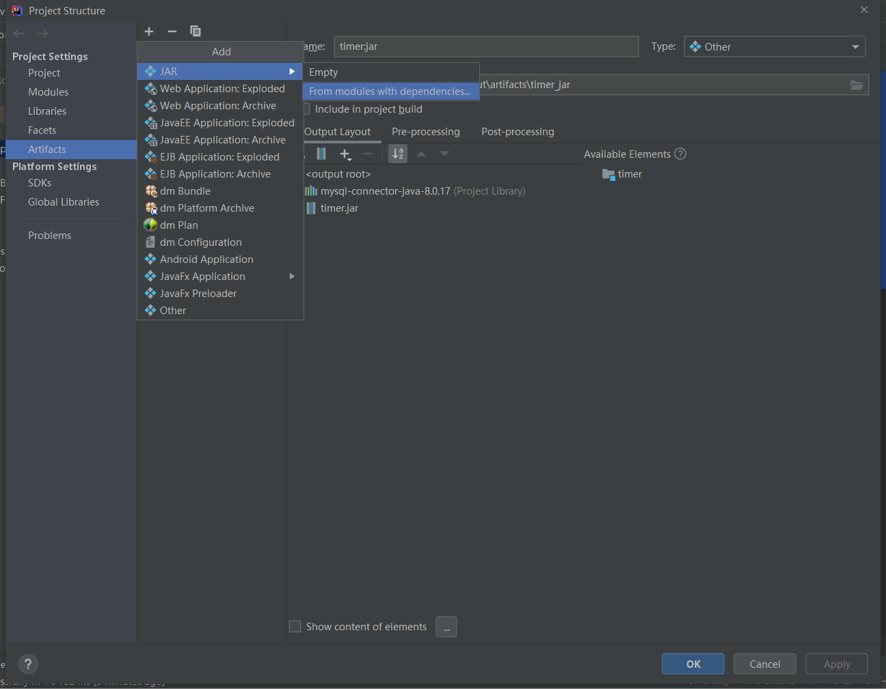
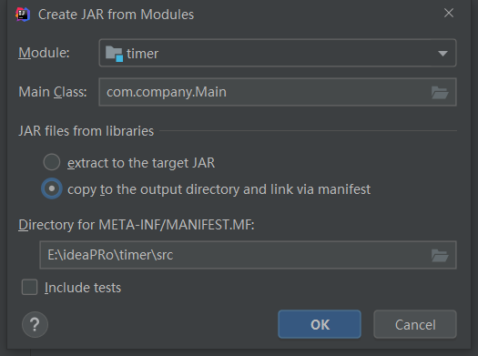
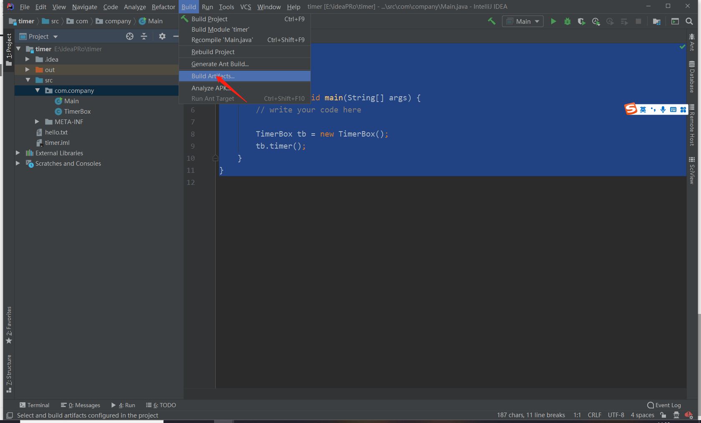
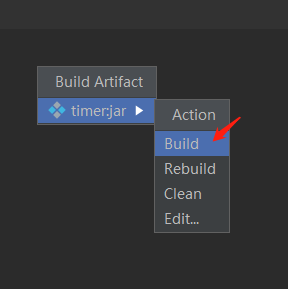
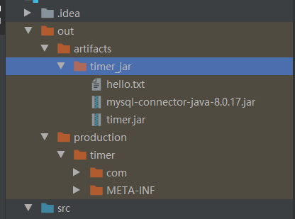

# 单个程序打包（idea）

## 1. file--》new project-->java




## 2.将想要想要打包的程序方法Main类同级目录




## 3.在Main类的main方法中调用TimerBox的方法

```java
package com.company;

public class Main {

    public static void main(String[] args) {
	// write your code here

        TimerBox tb = new TimerBox();
        tb.timer();
    }
}

```

此时TimerBox类不应有main方法

## 4 .打包

**file-->project structure-->artifacts-->jar-->from ....**












## 完成后会生成out目录，



在此路径下，使用命令java -jar timer.jar即可
